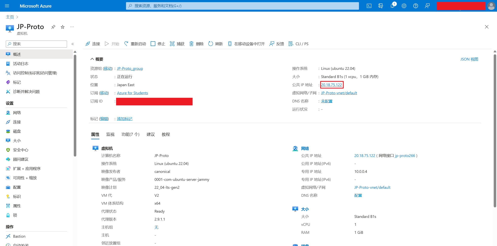

# azure自建节点（cs类专业的可以使用）

- 学生优惠
  - [大学生都可领取的免费服务器！使用Azure学生订阅创建免费的Linux和Windows服务器 - 知乎 (zhihu.com)](https://zhuanlan.zhihu.com/p/629609870)
- 利用v2ray搭建节点（即下面链接里的服务端内容）
  - [前言 · V2Ray 配置指南|V2Ray 白话文教程 (selierlin.github.io)](https://selierlin.github.io/v2ray/)
  - tls的内容也可以在上述链接搜素到
- **在自己电脑上跑的就是客户端，在服务器上跑的就是服务端/节点**


## 学生认证

- https://www.microsoft.com/zh-cn/education/products/office里面用自己的学校edu邮箱注册
- https://azure.microsoft.com/zh-cn/free/students/里面完成学生认证


## 虚拟机

- 进入[azure](https://portal.azure.com)创建虚拟机


- 配置基本信息后点击**下一步：磁盘**


- 配置磁盘，选择P6然后左下角**查看+创建**


## 配置v2ray服务端

- 把虚拟机的公网ip记下来，刚才配置时打的用户名和密码也别忘了



- 使用任意支持ssh的方法都可以，以下提供三种方法
  - terminal
    
  - xshell
    
    
  - putty
- 输入`sudo -i`
- 输入`bash <(curl -s -L https://git.io/v2ray.sh)`
- 输出信息即包括了订阅链接和端口号
  - 可以通过`v2ray i`查看服务端信息
  - 可以通过`v2ray status`查看服务端状态
  - 可以通过`v2ray config`修改配置（如修改端口号）


- 回到虚拟机的配置页，点击网络，添加入站规则，把服务端的端口给开了


- 回到客户端，把服务端输出的订阅链接复制到客户端就可以用了


## 其他

- azure好像把`ping`给禁了，所以不能`ping`节点来测试
- 这个方法速度比较快但似乎容易g，~~如果g了应该换个端口继续开又可以用~~ g了就是双向被墙，国内连不上节点，节点也ping不到国内网站
- 更安全的方法是在上述方法的基础上配置tls，但是我懒得搞了，参考[TLS · V2Ray 配置指南|V2Ray 白话文教程 (selierlin.github.io)](https://selierlin.github.io/v2ray/advanced/tls.html)
- [V2Ray搭建详细图文教程 · 233boy/v2ray Wiki (github.com)](https://github.com/233boy/v2ray/wiki/V2Ray搭建详细图文教程#哪个传输协议好)
- azure的学生认证似乎非常松，毕业了也可以用


# 延年益寿

## ss+aes

v2ray服务端安装好之后的默认配置是搞一个无加密的vmess，我到处发了一下链接然后没两天就挂了

> 参考某个机场的做法，我决定尝试一下使用shadowsocks协议+aes-128-gcm加密（也有我懒得折腾一个免费域名的原因在）

- 重新创建一个vm，安装后输入`v2ray`根据中文指引把默认生成的vmess配置给删了


- 输入`v2ray add ss`添加一个ss配置


- 输入`v2ray`，根据指引把加密方式改成aes-128-gcm


- 最后别忘了把这个端口给开放了


## others

希望不会再更了


# v2ray & clash客户端

- 百度找教程
- **在自己电脑上跑的就是客户端，在服务器上跑的就是服务端/节点**
- 这两个客户端都有手机的
- 参考的v2ray配置文件`guiNConfig`（直接替换v2rayN-core路径下的）
  - 保留了三个免费的订阅（有一个好像已经gg了）
  - 保留了自定义的PAC规则


```json
{
  "logEnabled": false,
  "loglevel": "warning",
  "indexId": "5595420507723044730",
  "muxEnabled": false,
  "sysProxyType": 1,
  "enableStatistics": false,
  "keepOlderDedupl": false,
  "statisticsFreshRate": 1,
  "remoteDNS": "8.8.8.8,\r\n114.114.114.114,",
  "domainStrategy4Freedom": "",
  "defAllowInsecure": false,
  "domainStrategy": "IPIfNonMatch",
  "domainMatcher": "",
  "routingIndex": 3,
  "enableRoutingAdvanced": true,
  "ignoreGeoUpdateCore": false,
  "systemProxyExceptions": "",
  "systemProxyAdvancedProtocol": "",
  "autoUpdateInterval": 0,
  "autoUpdateSubInterval": 0,
  "checkPreReleaseUpdate": false,
  "enableSecurityProtocolTls13": false,
  "trayMenuServersLimit": 30,
  "inbound": [
    {
      "localPort": 10808,
      "protocol": "socks",
      "udpEnabled": true,
      "sniffingEnabled": true,
      "allowLANConn": true,
      "user": "",
      "pass": ""
    }
  ],
  "vmess": [
    {
      "indexId": "4631940762273947790",
      "configType": 1,
      "configVersion": 2,
      "sort": 10,
      "address": "122237.xyz",
      "port": 2096,
      "id": "1fe39f32-b32e-48ea-854a-1733b473ca61",
      "alterId": 0,
      "security": "auto",
      "network": "ws",
      "remarks": "香港VMESS-azure",
      "headerType": "none",
      "requestHost": "",
      "path": "/Vtn8kuWS/",
      "streamSecurity": "tls",
      "allowInsecure": "False",
      "testResult": "操作超时",
      "subid": "5712321893565957447",
      "flow": "",
      "sni": "",
      "alpn": [],
      "groupId": "",
      "coreType": null,
      "preSocksPort": 0,
      "fingerprint": null
    }
  ],
  "kcpItem": {
    "mtu": 1350,
    "tti": 50,
    "uplinkCapacity": 12,
    "downlinkCapacity": 100,
    "congestion": false,
    "readBufferSize": 2,
    "writeBufferSize": 2
  },
  "subItem": [
    {
      "id": "4890460290840116010",
      "remarks": "1",
      "url": "https://raw.fastgit.org/freefq/free/master/v2",
      "enabled": false,
      "userAgent": "",
      "groupId": ""
    },
    {
      "id": "4695701750846774696",
      "remarks": "2",
      "url": "https://raw.githubusercontent.com/aiboboxx/v2rayfree/main/v2",
      "enabled": false,
      "userAgent": "",
      "groupId": ""
    },
    {
      "id": "5433694550333485069",
      "remarks": "3",
      "url": "https://iwxf.netlify.app",
      "enabled": false,
      "userAgent": "",
      "groupId": ""
    }
  ],
  "uiItem": {
    "enableAutoAdjustMainLvColWidth": true,
    "mainLocation": "-32000, -32000",
    "mainSize": "237, 39",
    "mainLvColWidth": {
      "def": 27,
      "configType": 47,
      "remarks": 138,
      "address": 120,
      "port": 40,
      "security": 60,
      "network": 60,
      "streamSecurity": 72,
      "subRemarks": 54,
      "testResult": 326
    }
  },
  "routings": [
    {
      "remarks": "绕过大陆(Whitelist)",
      "url": "",
      "rules": [
        {
          "type": null,
          "port": null,
          "inboundTag": null,
          "outboundTag": "direct",
          "ip": null,
          "domain": [
            "domain:example-example.com",
            "domain:example-example2.com"
          ],
          "protocol": null,
          "enabled": true
        },
        {
          "type": null,
          "port": null,
          "inboundTag": null,
          "outboundTag": "block",
          "ip": null,
          "domain": [
            "geosite:category-ads-all"
          ],
          "protocol": null,
          "enabled": true
        },
        {
          "type": null,
          "port": null,
          "inboundTag": null,
          "outboundTag": "direct",
          "ip": null,
          "domain": [
            "geosite:cn"
          ],
          "protocol": null,
          "enabled": true
        },
        {
          "type": null,
          "port": null,
          "inboundTag": null,
          "outboundTag": "direct",
          "ip": [
            "geoip:private",
            "geoip:cn"
          ],
          "domain": null,
          "protocol": null,
          "enabled": true
        },
        {
          "type": null,
          "port": "0-65535",
          "inboundTag": null,
          "outboundTag": "proxy",
          "ip": null,
          "domain": null,
          "protocol": null,
          "enabled": true
        }
      ],
      "enabled": true,
      "locked": false,
      "customIcon": null
    },
    {
      "remarks": "黑名单(Blacklist)",
      "url": "",
      "rules": [
        {
          "type": null,
          "port": null,
          "inboundTag": null,
          "outboundTag": "direct",
          "ip": null,
          "domain": null,
          "protocol": [
            "bittorrent"
          ],
          "enabled": true
        },
        {
          "type": null,
          "port": null,
          "inboundTag": null,
          "outboundTag": "block",
          "ip": null,
          "domain": [
            "geosite:category-ads-all"
          ],
          "protocol": null,
          "enabled": true
        },
        {
          "type": null,
          "port": null,
          "inboundTag": null,
          "outboundTag": "proxy",
          "ip": [
            "geoip:telegram"
          ],
          "domain": [
            "geosite:gfw",
            "geosite:greatfire",
            "geosite:tld-!cn"
          ],
          "protocol": null,
          "enabled": true
        },
        {
          "type": null,
          "port": "0-65535",
          "inboundTag": null,
          "outboundTag": "direct",
          "ip": null,
          "domain": null,
          "protocol": null,
          "enabled": true
        }
      ],
      "enabled": true,
      "locked": false,
      "customIcon": null
    },
    {
      "remarks": "全局(Global)",
      "url": "",
      "rules": [
        {
          "type": null,
          "port": "0-65535",
          "inboundTag": null,
          "outboundTag": "proxy",
          "ip": null,
          "domain": null,
          "protocol": null,
          "enabled": true
        }
      ],
      "enabled": true,
      "locked": false,
      "customIcon": null
    },
    {
      "remarks": "PAC|PAC",
      "url": "",
      "rules": [
        {
          "type": null,
          "port": null,
          "inboundTag": [],
          "outboundTag": "proxy",
          "ip": null,
          "domain": [
            "github.com",
            "githubassets.com",
            "githubusercontent.com",
            "google-analytics.com",
            "gstatic.com",
            "googleapis.com",
            "developers.google.com",
            "domain:jrkan.com",
            "domain:http://play.sportsteam365.com",
            "domain:http://play.sportsteam357.com",
            "domain:bazel.build",
            "domain:https://stackoverflow.com/",
            "openai.com",
            "yhdmp.cc",
            "civitai.com",
            "https://games-cn.org/",
            "https://coolors.co/"
          ],
          "protocol": null,
          "enabled": true
        },
        {
          "type": null,
          "port": null,
          "inboundTag": null,
          "outboundTag": "block",
          "ip": null,
          "domain": [
            "#阻止CrxMouse鼠标手势收集上网数据",
            "mousegesturesapi.com"
          ],
          "protocol": null,
          "enabled": true
        },
        {
          "type": null,
          "port": null,
          "inboundTag": [],
          "outboundTag": "direct",
          "ip": null,
          "domain": [
            "bitwarden.com",
            "bitwarden.net",
            "baiyunju.cc",
            "letsencrypt.org",
            "adblockplus.org",
            "safesugar.net",
            "#下两行谷歌广告",
            "googleads.g.doubleclick.net",
            "adservice.google.com",
            "#【以下全部是geo预定义域名列表】",
            "#下一行是所有私有域名",
            "geosite:private",
            "#下一行包含常见大陆站点域名和CNNIC管理的大陆域名，即geolocation-cn和tld-cn的合集",
            "geosite:cn",
            "#下一行包含所有Adobe旗下域名",
            "geosite:adobe",
            "#下一行包含所有Adobe正版激活域名",
            "geosite:adobe-activation",
            "#下一行包含所有微软旗下域名",
            "geosite:microsoft",
            "#下一行包含微软msn相关域名少数与上一行微软列表重复",
            "geosite:msn",
            "#下一行包含所有苹果旗下域名",
            "geosite:apple",
            "#下一行包含所有广告平台、提供商域名",
            "geosite:category-ads-all",
            "#下一行包含可直连访问谷歌网址，需要替换为加强版GEO文件，如已手动更新为加强版GEO文件，删除此行前面的#号使其生效",
            "#geosite:google-cn",
            "#下一行包含可直连访问苹果网址，需要替换为加强版GEO文件，如已手动更新为加强版GEO文件，删除此行前面的#号使其生效",
            "#geosite:apple-cn"
          ],
          "protocol": null,
          "enabled": true
        },
        {
          "type": "field",
          "port": null,
          "inboundTag": null,
          "outboundTag": "proxy",
          "ip": null,
          "domain": [
            "#GFW域名列表",
            "geosite:gfw",
            "geosite:greatfire"
          ],
          "protocol": null,
          "enabled": true
        },
        {
          "type": "field",
          "port": "0-65535",
          "inboundTag": [],
          "outboundTag": "direct",
          "ip": null,
          "domain": null,
          "protocol": null,
          "enabled": true
        }
      ],
      "enabled": true,
      "locked": false,
      "customIcon": ""
    },
    {
      "remarks": "locked",
      "url": "",
      "rules": [
        {
          "type": null,
          "port": null,
          "inboundTag": null,
          "outboundTag": "proxy",
          "ip": [],
          "domain": [
            "geosite:google"
          ],
          "protocol": null,
          "enabled": true
        },
        {
          "type": null,
          "port": null,
          "inboundTag": null,
          "outboundTag": "direct",
          "ip": [],
          "domain": [
            "domain:example-example.com",
            "domain:example-example2.com"
          ],
          "protocol": null,
          "enabled": true
        },
        {
          "type": null,
          "port": null,
          "inboundTag": null,
          "outboundTag": "block",
          "ip": [],
          "domain": [
            "geosite:category-ads-all"
          ],
          "protocol": null,
          "enabled": true
        }
      ],
      "enabled": true,
      "locked": true,
      "customIcon": null
    }
  ],
  "constItem": {
    "speedTestUrl": "http://cachefly.cachefly.net/10mb.test",
    "speedPingTestUrl": "https://www.google.com/generate_204",
    "defIEProxyExceptions": "localhost;127.*;10.*;172.16.*;172.17.*;172.18.*;172.19.*;172.20.*;172.21.*;172.22.*;172.23.*;172.24.*;172.25.*;172.26.*;172.27.*;172.28.*;172.29.*;172.30.*;172.31.*;192.168.*"
  },
  "globalHotkeys": [
    {
      "eGlobalHotkey": 0,
      "Alt": false,
      "Control": false,
      "Shift": false,
      "KeyCode": null
    },
    {
      "eGlobalHotkey": 1,
      "Alt": false,
      "Control": false,
      "Shift": false,
      "KeyCode": null
    },
    {
      "eGlobalHotkey": 2,
      "Alt": false,
      "Control": false,
      "Shift": false,
      "KeyCode": null
    },
    {
      "eGlobalHotkey": 3,
      "Alt": false,
      "Control": false,
      "Shift": false,
      "KeyCode": null
    }
  ],
  "groupItem": [],
  "coreTypeItem": [
    {
      "configType": 1,
      "coreType": 2
    },
    {
      "configType": 2,
      "coreType": 2
    },
    {
      "configType": 3,
      "coreType": 2
    },
    {
      "configType": 4,
      "coreType": 2
    },
    {
      "configType": 5,
      "coreType": 2
    },
    {
      "configType": 6,
      "coreType": 2
    }
  ]
}
```


