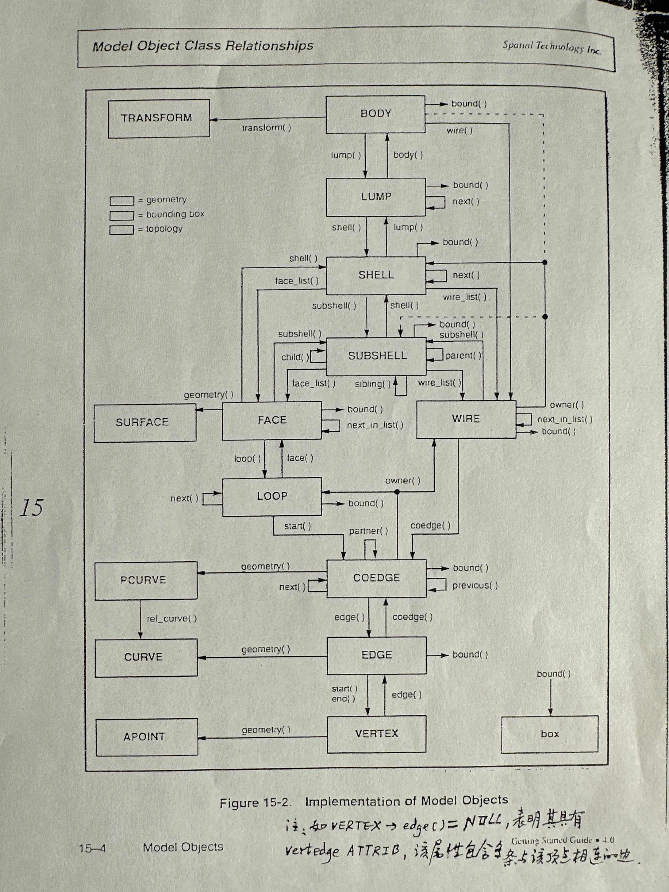

# 实体造型系统

## 1. 系统结构

```
用户界面 ---> 实体建模的功能模块 ---> 实体模型 ---> 应用算法 ---> 应用问题
   ↑									  |
   └----------------模型库-----------------┘
```

模型库的模型一般存为中性文件，比如stp格式


## 2. 几个问题

### 实体表示的选择

|      |                             Brep                             |                             CSG                              |                              DM                              |
| :--: | :----------------------------------------------------------: | :----------------------------------------------------------: | :----------------------------------------------------------: |
| 优点 | 显式且精确的表示，支持对它们进行交互访问和修改；<br />可以支持局部操作；<br />可以支持几何约束表示<br />可以支持表达很多产品的非几何信息，如公差； |        表示简洁，记录了建模的过程（支持undo和redo）；        |        表示了表面内部的信息，可以支持体积计算等操作；        |
| 缺点 | 表示与相关算法复杂，记录了建模的结果；<br />没有记录建模过程，不能redo和undo | 不支持交互访问和修改；<br />表示不唯一；<br />不支持局部操作；<br />不支持几何约束表示；<br />不支持表达非几何信息； | 逼近表示，不精确；<br />空间效率低，存储不友好；<br />没有记录建模过程，不能redo和undo |

理想的方式：三种表示并存

- 问题：高度复杂，难以保证一致性

实用的方式：以Brep为主，以CSG和DM为辅

- 路线1：GUI以CSG表示 -> 修正的CSG表示 -> 从CSG转化为Brep表示
- 路线2：GUI以CSG表示 -> 局部操作，直接建模得到Brep表示
- 何为修正的CSG：对CSG的基本体素用Brep表示
- 仅采用Brep表示的算法，不采用CSG表示的算法


### 求交

- 曲面种类多样
- 存在精度、可靠性等问题


求交算法设计

- 统一求交算法
  - 统一成平面多边形求交
  - NURBS求交（同样有精度等问题）
- 多种求交算法并存，分类讨论，设计多种针对性的求交算法
- 自由曲面求交方程。
  - 理论方法，用NURBS很复杂
    - 曲面分别为$S_1(u,v)$和$S_2(u,v)$
    - $S_1$隐式化得到$f(x,y,z)$，带入$S_2$有交线$f(x_2(u,v),\ y_2(u,v),\ z_2(u,v))=0$
    - 可以证明，这个最后会是一个324次曲线
  - 实用方法：[跟踪法](https://www.cnblogs.com/opencascade/p/IntWalk_PWalking.html)
    - 确定初始交点
    - 确定跟踪方向，两个切平面法向的叉积
    - 确定跟踪步长
    - 连续跟踪下一个交点，直至曲面边界或回到初始交点
    - 初始交点精化方法
  - 确定初始交点：采样uv线，分析整体的几何拓扑结构
- 求交的情况
  - 与边界有交点
  - 与边界无交点
  - 与边界无交点切有环
  - 只交于一个点（切点）
  - 交成一个8字，怎么确定跟踪方向？


### 裁剪曲面trimmed surface

- 定义：一张完整的曲面经过与实体求交后被裁剪出的部分曲面
  - 边界需要显式的表示了，不能再通过隐式的表示
- 表示：通过曲面的参数方程，其**参数域**以及**空间边界线**共同表示
  - 参数域以及空间边界线即为显式表示
- 对于两个相交面，$S_1$上的交线投影到空间的曲线应该和$S_2$上投影到空间的曲线一致，这对于逼近表示来说是困难的，that is，not watertight（水密）
  - 一个解决方案，对相交区域重新三角面离散化，但是也要确保交线处的精度


## 3. 系统可靠性问题

### 布尔运算

- 原因分析
  - 主要是精度可能会造成问题
  - 几何关系的判别是相对于容差的，几何关系的判别存在相关性
  - 直接原因：相对的几何关系的判别可能会造成相关的几何关系发生冲突
  - 根本原因：计算机的**浮点表示**造成的
- 基于点面容差的方法，面为平面多边形
  - 种类
    - 点面PF
    - 点边PE
    - 点点PP
    - 边面EF
    - 边边EE
    - 面面FF
  - 所有都统一到判别PF
  - 点面重合关系的判断方法：给定一个容差$\epsilon$，点$P$和面$F=\{u_1,u_2,...,u_n\}$
    - 设$F$的方程为$ax+by+cz=d$，用线性方程方法求解
    - 定义容差$t_p=2*\max^n_{i=1}|d_i|$，**用来确保计算面F的点都会被判定为在面上**
    - 则如果$|dist(P,F)|\leq t_p+\epsilon$，认为P与F重合
  - 基于点面来判别其他的重合关系
    - 通过PF判定FF，PE和EF
    - 通过PE判定PP和EE
    - 如果出现了不一致，也可以做到心里有数
- 基于几何元素局部、动态容差的方法
  - 一个问题，假设两条无限长的直线要判断重合，
    - 交点附近采样可能会判定相邻的两个点重合
    - 继续采样，一定范围内可能相邻的点都会被判定重合
    - 判定采样序列的第一个点和最后一个点，**很有可能显然并不符合重合的判定**
  - 几何元素的内部容差表示
    - 比如一个点设置三个容差带，从小到大分别是$\epsilon, \delta,\Delta$，由几何元素和它的三个容差带共同表示
    - $\epsilon=\tau-\gamma,\ \delta=\tau+\gamma,\ \gamma<<\tau$
    - 因为浮点数表示，不能进行精确判断，需要容差带
  - 几何元素容差的动态调整方法
    - 同维元素的重合关系判断条件：$O_1$和$O_2$在它们的$\epsilon$域交集内存在一个它们交集范围的逼近表示，则$O_1$和$O_2$重合
    - 同维元素的容差调整方法：基于逼近产生一个新的容差表示（元素+三个容差域），$\epsilon$域和$\Delta$域取二者相应**交集中的最大可能域**，$\delta$域是相应域的**并集中的最大可能域**
    - 调整的时候可能会出现$\delta$和$\Delta$大小不符合定义


# ACIS

[ACIS介绍 | feelapi](https://www.feelapi.com/ACIS介绍.html)

[ACIS-Model Topology_acis csdn-CSDN博客](https://blog.csdn.net/learningloong/article/details/37877163)

## 目标

- 开发一个具有灵活、可扩度、开放结构的三维几何造型引擎，有效支持CAX系统开发
- 相关
  - BUILD
  - parasolid
  - CGM


## 系统结构

- applications
- data exchange
- ACTS kernel
- LO?
- AB?


## 先进的Brep数据结构



- 目标：
  - 线框、曲面、实体一体化表示
  - 能够统一表示流形与非流形体
  - 有效表示任意裁剪曲面
  - 允许对他定义的数据结构进行扩展
- 类体系
  - GEOMETRY
    - TRANSFORM
    - APOINT
    - CURVE 一般的空间曲线
      - STRAIGHT
        - root_point()
        - direction()
      - ELLIPSE
        - center()
        - normal()
        - major_axis()
        - radius_ratio()
      - INTCURVE 求交求出来的交线，用B-spline
        - bs3_curve()
        - 两个bs3_surface指针
        - 两个bs2_curve指针
      - COMPCURVE
    - PCURVE 参数面上的曲线，用B-spline
      - bs2_curve()
      - bs3_surface()
      - fit_tolerance
    - SURFACE
      - PLANE
        - center()
        - normal()
      - CONE
        - ellipse指针
      - SPHERE
      - TORUS 圆环
        - center()
        - normal()
        - major_radius()
        - minor_radius()
      - SPLINE
      - MESH
  - TOPOLOGY
    - BODY
    - LUMP: A 1D, 2D, or 3D set of points in space that is **disjoint with all other lumps**. It is bounded by shells.
    - SHELL: A set of connected faces and wires, and **can bound the outside of a solid or an internal void (hollow)**. *Subshells* form a further decomposition of shells for internal efficiency purposes
    - SUBSHELL
    - FACE
      - 有个sense属性，表示FACE与其引用得SURFACE法向相同还是相反
      - 有个sidedness属性，A face's *sidedness* indicates whether it is single-sided or double-sided
      - 有个containment属性，A double-sided face's *containment* indicates whether or not the double-sided face is embedded within another region (i.e., contained)
    - WIRE: A connected series of coedges that are **not attached to a face**.
    - LOOP
    - COEDGE
      - 即halfedge?
      - 有个sense属性
      - partner，把所有属于同一条边的半边链接在一起
    - EDGE
      - 有个sense属性
    - VERTEX
  - ATTRIBUTE
    - ATTRIB
- 容差 resolution
  - resabs，默认为10^-6^ mm
  - resnor，容差有效位数
  - resfit，曲线曲面的逼近误差，10^-3^

- 应用接口
  - c++
  - scheme
  - MFC


