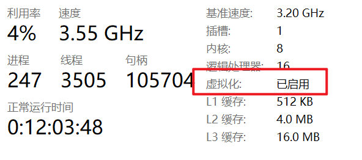
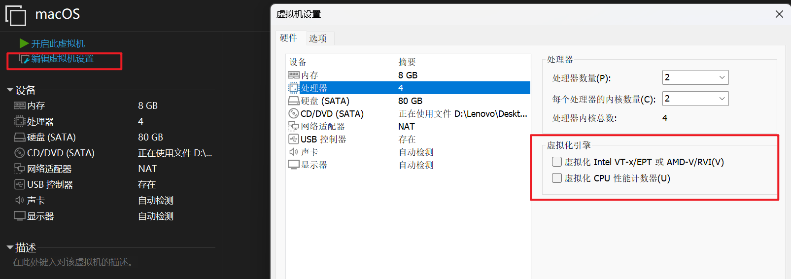
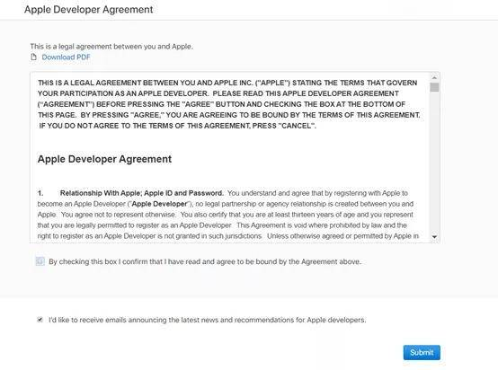
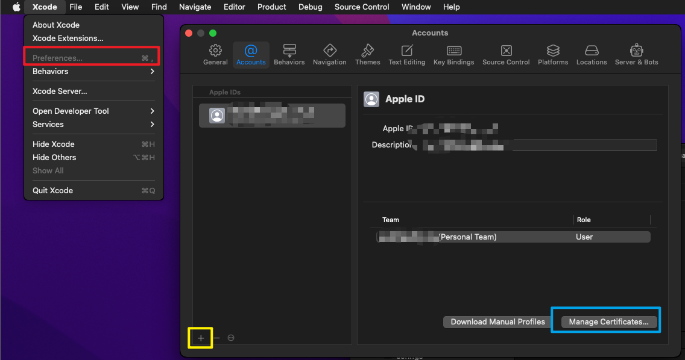
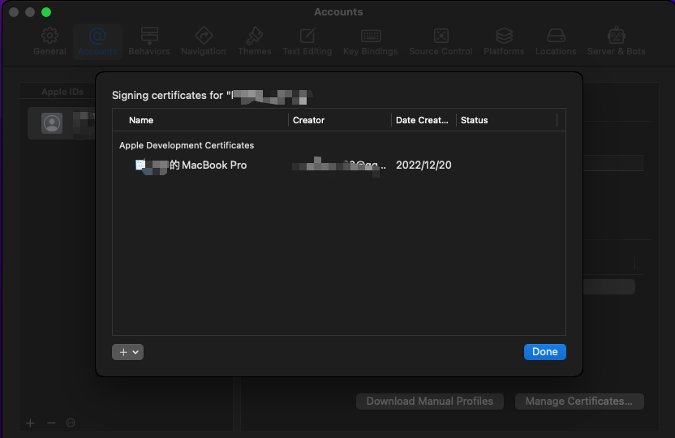
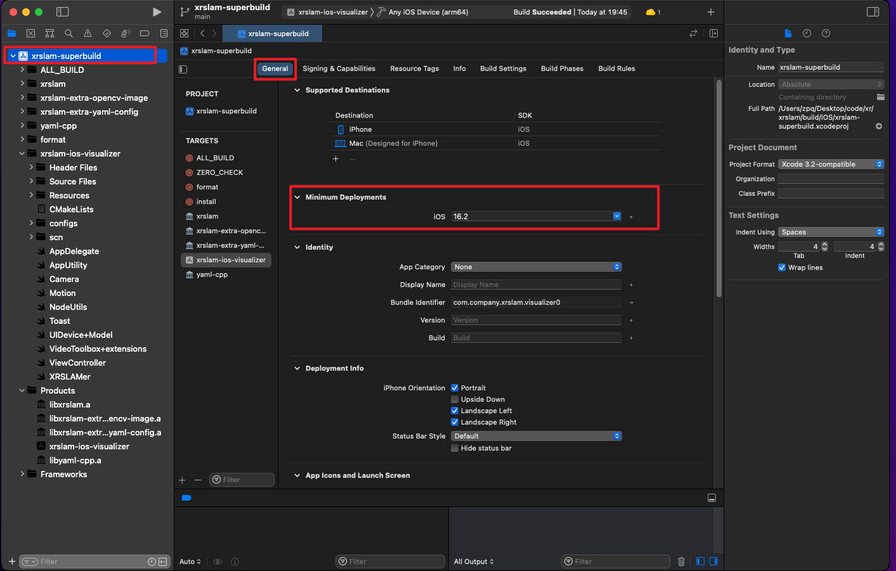
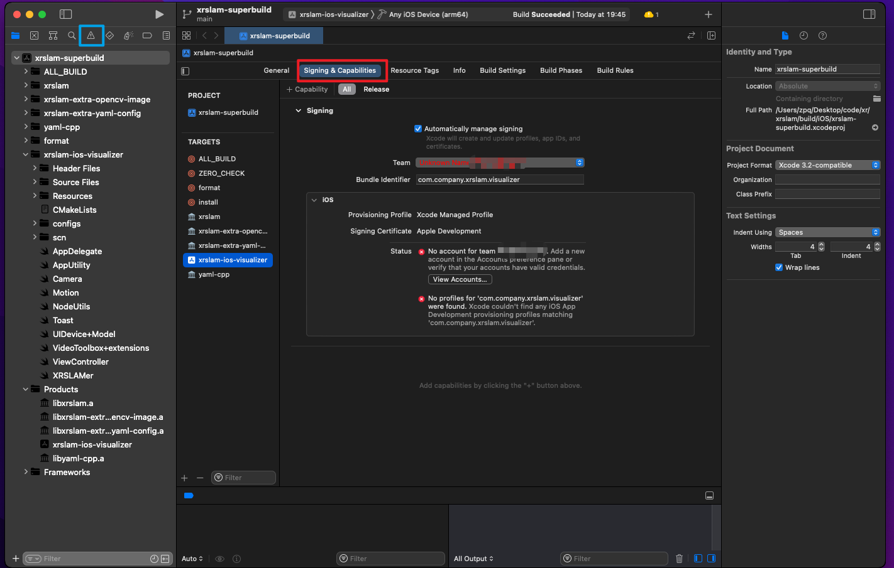
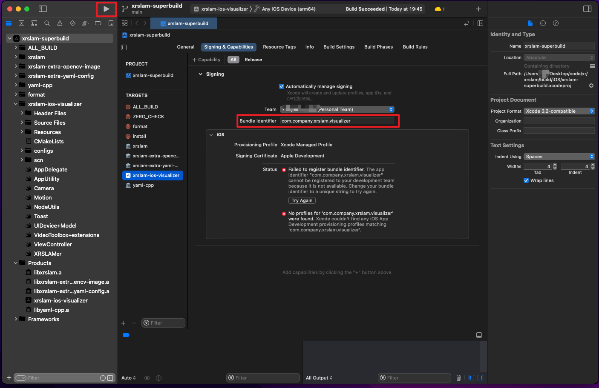
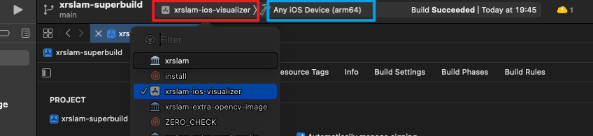

# PC

```powershell
$ winver
版本21H2
$ systeminfo

主机名:           -ZPQQQ
OS 名称:          Microsoft Windows 11 家庭中文版
OS 版本:          10.0.22000 暂缺 Build 22000
OS 制造商:        Microsoft Corporation
OS 配置:          独立工作站
OS 构建类型:      Multiprocessor Free
注册的所有人:     Lenovo
注册的组织:       暂缺
产品 ID:          00342-30639-37934-AAOEM
初始安装日期:     2022/8/21, 0:18:23
系统启动时间:     2022/12/12, 23:33:54
系统制造商:       LENOVO
系统型号:         82L5
系统类型:         x64-based PC
处理器:           安装了 1 个处理器。
                  [01]: AMD64 Family 25 Model 80 Stepping 0 AuthenticAMD ~3201 Mhz AMD Ryzen 7 5800H
BIOS 版本:        LENOVO GSCN31WW, 2022/1/28
...
$ wsl -l -v
  NAME            STATE           VERSION
* Ubuntu-22.04    Stopped         2
```


# 小丑了！看这些issues

> [macOS Ventura Guests · DrDonk/unlocker Wiki (github.com)](https://github.com/DrDonk/unlocker/wiki/macOS-Ventura-Guests)
>
> [Vmware MacOS-BigSur in win10 - Stack Overflow](https://stackoverflow.com/questions/67025805/vmware-macos-bigsur-in-win10)
>
> [Test using AMD Ryzen CPU · Issue #33 · DrDonk/unlocker (github.com)](https://github.com/DrDonk/unlocker/issues/33)
>
> [macOS Ventura Testing · Issue #47 · DrDonk/unlocker (github.com)](https://github.com/DrDonk/unlocker/issues/47#issue-1440512657)

应该是amd ryzen cpu的问题……没有easy fix……从macos13 ventura开始估计就不行了……


# Tools

* [VMWare 17.5.1](https://www.vmware.com/products/workstation-pro/workstation-pro-evaluation.html)
  * The version chosen is **very important**, since some older versions are not compatible with WSL2
  * Licenses are everywhere
* Unlocker
  * [Releases · DrDonk/unlocker 4..x.x](https://github.com/DrDonk/unlocker/releases)
  * [Releases · BDisp/unlocker 3.x.x](https://github.com/BDisp/unlocker/releases)
* MacOS cdr/iso
  * [苹果系统之家 - mac软件,macOS镜像,macOS教程,黑苹果教程软件分享 (macoshome.com)](https://macoshome.com/)
  * [MacOS Images](https://www.apple114.com/pages/macos/)
  * **only works until macos 12 monterey**
* [VMWare Tools](https://blog.csdn.net/weixin_46324719/article/details/123281311)
  * iso can be found in this repo


# IMPORTANT

- vmware17和wsl2兼容，不用操作内核隔离和hyper-v（虽然理论上vmware16应该也兼容，但我当时操作的时候确实报错了）
  
- 在**任务管理器-性能-CPU**中检查是否开启虚拟化，如果未开启则通过BIOS开启虚拟化




# Installation

## VMWare

正常运行安装程序进行安装即可


## Unlocker

1. 解压得到Unlocker 4.2.6
3. 关闭VMWare的进程（VMWare开头）和**五个服务**（VM开头）


4. 在unlocker文件夹中找到`windows/unlock.exe`，运行即可
4. 重启电脑
4. 每次更新vmware版本后，重新进行一次该步骤

> 如果使用NAT模式的虚拟机无法上网，可能是这一步关闭的服务没有重新启动，手动开启运行即可


## Create MacOS

1. 创建虚拟机并选择自定义


2. 硬件兼容性选择17.x（决定了哪些版本的Workstation可以运行这个虚拟机）
   不能选低于17.x的，会报错vmware版本不支持14.4的macos（根据我之前在vm16直接升级到macos13 Ventura的经验，估计vm16也不支持macos13 Ventura）

3. 选择使用下载好的镜像，要选择cdr文件需要在选择文件时将文件类型改为所有文件；不必理会这里的警告

.assets/image-20240329112823477.png)

4. 选择与镜像对应的版本

.assets/image-20240329112834202.png)

5. 随便取个名字

.assets/image-20240329113056559.png)

6. 这个设置于取决于host的硬件水平了，对于R7 5800H来说，四核比较好

.assets/image-20240328184528642.png)

7. 内存我配置了8G，根据实体机的内存来决定即可

.assets/image-20240328184622787.png)

8. 后续的配置选择默认的 **使用网络地址转换（NAT）** - **LSI Logic(L)** - **SATA(A)** - **创建新虚拟磁盘(V)** 即可
9. 磁盘大小不要小于推荐的即可，这里我分配了80G，建议选择**将虚拟磁盘拆分成多个文件**；下一步的磁盘文件名使用默认的即可

.assets/image-20240329113147307.png)

10. 查看总结信息，点击完成即可

.assets/image-20240329113201979.png)

11. 打开虚拟机保存的路径，用记事本或者VSCode修改虚拟机配置文件`.vmx`，在这里即为`D:\Lenovo\Documents\Virtual Machines\macOS\macOS.vmx`；在文件的末尾添加配置。即[这里](https://blog.csdn.net/qq_17576885/article/details/121407125)的方法三提供的配置。

    ```
    smc.version = "0"
    cpuid.0.eax = "0000:0000:0000:0000:0000:0000:0000:1011"
    cpuid.0.ebx = "0111:0101:0110:1110:0110:0101:0100:0111"
    cpuid.0.ecx = "0110:1100:0110:0101:0111:0100:0110:1110"
    cpuid.0.edx = "0100:1001:0110:0101:0110:1110:0110:1001"
    cpuid.1.eax = "0000:0000:0000:0001:0000:0110:0111:0001"
    cpuid.1.ebx = "0000:0010:0000:0001:0000:1000:0000:0000"
    cpuid.1.ecx = "1000:0010:1001:1000:0010:0010:0000:0011"
    cpuid.1.edx = "0000:0111:1000:1011:1111:1011:1111:1111"
    featureCompat.enable = "TRUE"
    hw.model = "iMac20,2"
    board-id = "Mac-AF89B6D9451A490B"
    ```

    > 事实上，这里要加配置也是因为macos虚拟机对amd cpu的支持不太友好

12. 在虚拟机设置中点击处理器，确认虚拟化引擎所有项均未被勾选后，可以开启虚拟机。如果开启了，我的电脑会报不支持的错误。（如果到这里还报其他的错，就需要靠搜索引擎解决了）



13. 等待进度条拉满后，在语言选择页面选择简体中文。在设置安装页面，选择**实用工具**-**磁盘工具**

.assets/image-20240329113525112.png)

在磁盘工具中依次进行操作，其中名称随意即可：

.assets/image-20240328190831438.png)

14. 完成后，关闭磁盘工具，根据[关闭csrutil](https://www.jianshu.com/p/d7d4d7ba95a3)教程，在实用工具这里打开终端关闭csrutil（后面有可能无法进入恢复模式，这似乎是一个bug：[Solved: Can't boot into recovery partition on macOS 11 (Bi... - VMware Technology Network VMTN](https://communities.vmware.com/t5/VMware-Fusion-Discussions/Can-t-boot-into-recovery-partition-on-macOS-11-Big-Sur/td-p/2298419)）
14. 设置安装页面点击**安装monterey**和**继续**，阅读同意协议后，将系统安装到刚刚抹除过的磁盘上

.assets/image-20240329113511321.png)

15. 安装完成后，系统自动重启。进入虚拟机，**选择国家地区** - **选择键盘布局** - **选择连接本地网络** - **选择现在不传输任何信息** - **同意软件协议** - **创建账号**
16. 进入MacOS


> [macOS Ventura Guests · DrDonk/unlocker Wiki (github.com)](https://github.com/DrDonk/unlocker/wiki/macOS-Ventura-Guests)
>
> 好像是cpu的问题……会出错
>
> fails:
>
> - vmx里面修改virtualHW.version为10
> - 减少cpu数量
> - [Vmware 17 goes in bootloop after Ventura install in AMD CPU (AVX2 IS SUPPORTED!) · Issue #106 · paolo-projects/auto-unlocker (github.com)](https://github.com/paolo-projects/auto-unlocker/issues/106) 
>   - `Sonoma works with Ryzen 7 4800H. The problem is it works only with 4 cores`


## VMWare Tools

1. 我直接安装macos12 monterey，在amd cpu上，使用的镜像是unlocker426携带的`darwin.iso`
3. 跟随[教程](https://blog.csdn.net/weixin_46324719/article/details/123281311)走即可，安装之后虚拟机可以全屏


## Update MacOS

> 最多到macos12

- 版本比较新的MacOS才能安装使用Xcode，因此要更新系统
- [苹果电脑老系统怎么更新到最新？ - 知乎 (zhihu.com)](https://zhuanlan.zhihu.com/p/356324207)
  - 在我这里升到13.1会崩……目前使用12.6.2一切稳定
  - 原因如上述

- [在 Mac 上更新 macOS - 官方 Apple 支持 (中国)](https://support.apple.com/zh-cn/HT201541)


# Configuration

## v2rayU

- [yanue/V2rayU: V2rayU,基于v2ray核心的mac版客户端,用于科学上网,使用swift编写,支持vmess,shadowsocks,socks5等服务协议,支持订阅, 支持二维码,剪贴板导入,手动配置,二维码分享等 (github.com)](https://github.com/yanue/V2rayU)

- 终端使用代理，在`~/.zprofile`加入（这里是使用虚拟机内部的v2rayU的端口）
  ```bash
  alias proxy="export ALL_PROXY=socks5://127.0.0.1:1080" 
  alias unproxy="unset ALL_PROXY "
  ```


## brew

使用命令即可（国内源）：

```bash
/bin/bash -c "$(curl -fsSL https://cdn.jsdelivr.net/gh/ineo6/homebrew-install/install.sh)"
```

optional: 如果安装完毕后输入`brew help`提示命令没找到，则根据自己的芯片和shell使用：

- M1

  - zsh

    ```bash
    echo 'eval "$(/opt/homebrew/bin/brew shellenv)"' >> ~/.zprofile
    eval "$(/opt/homebrew/bin/brew shellenv)"
    ```

  - bash
    ```bash
    echo 'eval "$(/opt/homebrew/bin/brew shellenv)"' >> ~/.zprofile
    eval "$(/opt/homebrew/bin/brew shellenv)"
    ```

- Intel

  - zsh
    ```bash
    echo 'eval "$(/usr/local/Homebrew/bin/brew shellenv)"' >> ~/.zprofile
    eval "$(/usr/local/Homebrew/bin/brew shellenv)"
    ```

  - bash
    ```bash
    echo 'eval "$(/usr/local/Homebrew/bin/brew shellenv)"' >> ~/.bash_profile
    eval "$(/usr/local/Homebrew/bin/brew shellenv)"
    ```


## git

- [Mac安装Git_rockvine的博客-CSDN博客_mac安装git](https://blog.csdn.net/rockvine/article/details/122898165)


## Xcode

- 升级到MacOS 12.5以上系统，在App Store直接下载即可
- 运行的时候遇到的，optional：`sudo xcode-select -s /Applications/Xcode.app/Contents/Developer`


## Others

- [Mac虚拟机一——扩大磁盘_joey小天使的博客-CSDN博客_虚拟机扩充磁盘大小100g](https://blog.csdn.net/joey_ro/article/details/106470070)
- [用Mac终端打开python3而不是python2（一文详细解决）_西瓜6的博客-CSDN博客](https://blog.csdn.net/qq_37924224/article/details/109642307)
  - 有些代码是直接指定bin的路径，对于这种情况，简单地在终端写入一个alias是不够的，需要一个软链接
  - 在`Monterey 12.6`，自带的python已经是python3而不是python2，通过`which python3`可以找到内建python3的位置`/usr/bin/python3`（没有python）
  - 按照Linux的思路，通过`sudo ln -s /usr/bin/python3 /usr/bin/python `即可，但是会报一个`operation not permitted`的错
  - 改变软链接的路径，将代码变成`sudo ln -s /usr/bin/python3 /usr/local/bin/python`，此时可以创建软链接，但是在终端运行`python`会提示需要Xcode的命令行工具（此时是已经安装过了的）
  - 最终解决方案：
    - 手动从[python官网](https://www.python.org/)下载安装一个3.10的python，此时在终端输入`python3`可以运行3.10，系统内依然找不到`python`
    - 在终端输入```sudo ln -s ` which python3` /usr/local/bin/python```，即可解决此类问题

- [VSCode官网](https://code.visualstudio.com/)下载安装VSCode
  - 运行后会有显示问题，使用老版本（如1.68解决）

- [手把手教你MacOS上如何美化原生命令行Terminal（2022年年初版） - 知乎 (zhihu.com)](https://zhuanlan.zhihu.com/p/460076507)
- [如何调节MAC 命令行终端字体大小_一棵栗子树的博客-CSDN博客_mac设置终端字体大小](https://blog.csdn.net/flyconley/article/details/116608428)
- [MacOS如何显示文件完整路径？ - 知乎 (zhihu.com)](https://zhuanlan.zhihu.com/p/80063888)
- [开发者账号和TeamId如何查看_ezreal_tao的博客-CSDN博客](https://blog.csdn.net/ezreal_tao/article/details/104106356)
- [2021年Apple Developer 开发者账号申请&实名认证超详细教程 - 知乎 (zhihu.com)](https://zhuanlan.zhihu.com/p/340651153)


# An example of running XRSlam with Xcode

- 一个来自实验室的任务，在iphone上把xrslam跑起来

- 准备

  - 需要的仓库

    - [openxrlab/xrprimer: OpenXRLab foundational library for XR-related algorithms (github.com)](https://github.com/openxrlab/xrprimer)

    - [openxrlab/xrslam: OpenXRLab Visual-inertial SLAM Toolbox and Benchmark (github.com)](https://github.com/openxrlab/xrslam)

    - ```bash
      xr
      ├── xrprimer
      │   ├── CITATION.cff
      │   ├── CMakeLists.txt
      │   ├── Dockerfile
      │   ├── LICENSE
      │   ├── README.md
      │   ├── README_CN.md
      │   ├── build-ios.sh
      │   ├── cmake
      │   ├── conanfile.txt
      │   ├── cpp
      │   ├── docs
      │   ├── install
      │   ├── python
      │   │   └── xrprimer
      │   ├── requirements
      │   ├── setup.cfg
      │   ├── setup.py
      │   ├── utils
      │   └── version.txt
      └── xrslam
          ├── CITATION.cff
          ├── CMakeLists.txt
          ├── Dockerfile
          ├── LICENSE
          ├── README.md
          ├── build
          ├── build-ios.conf
          ├── build-ios.conf.defaults
          ├── build-ios.sh
          ├── cmake
          ├── configs
          ├── data
          │   └── EuRoC
          ├── docs
          ├── resources
          ├── trajectory.tum
          ├── xrslam
          ├── xrslam-extra
          ├── xrslam-ios
          ├── xrslam-pc
          └── xrslam-test
      ```

  - EuRoC data (according to [the data preparation documents](https://github.com/openxrlab/xrslam/blob/main/docs/en/dataset_preparation.md))

  - apple ID

  - python

  - cmake

  - ...


1. 成为开发者：在[开发者官网的帐户页面](https://developer.apple.com/account)登录，然后同意开发者协议即可



2. 打开Xcode，打开设置，进入账号选项。如果左侧列表没有出现apple id，则点击黄色框内的加号添加自己的苹果id；有的话，点击自己的苹果id，选中Personal Team后点击蓝色框内的Manage Certificates



3. 点击加号添加一个代表本机的Apple Development凭证



4. 打开一个终端，根据仓库的文档指导，输入命令

```bash
cd xr
cd xrprimer
git checkout xrslam-opencv3.4.7
cmake -S. -Bbuild -DBUILD_EXTERNAL=ON -DCMAKE_BUILD_TYPE=Release -DENABLE_PRECOMPILED_HEADERS=OFF && cmake --build build --target install -j8
cd ../xrslam && cmake -B build && cmake --build build -j8
cd ..
xrprimer/build-ios.sh
xrslam/build-ios.sh
```

5. 此时`xr/xrslam`下会出现`build-ios.conf`，其中需要填入`IOS_DEVELOPMENT_TEAM`，通过如下命令查询并填入（括号内的十位字符串）

```bash
$ security find-identity -v -p codesigning
  1) ... "Apple Development: xxxxxxxxxx@xx.com (XXXXXXXXXX)"
     1 valid identities found
```

6. 再次运行`xrslam/build-ios.sh`，在我的虚拟机上，最后会报错提示`No account for team "XXXXXXXXXX"`；但是此时已经出现了Xcode工程，用Xcode打开工程`xr/xrslam/build/iOS/xrslam-superbuild.xcodeproj`
7. 打开工程，由左向右依次点击红框内容，部署要求的最低版本设为16.2，这个是仓库要求的iOS版本（默认即为16.2，同时这意味着真机的iOS版本也要为16.2及以上）



8. 点击蓝色框，可以查看到刚才的报错信息。点击红色框，可以看到红字提示了报错信息，点击选择第二步中出现过的Personal Team



9. 再次点击运行按钮，可以看到报错变了，这个是因为bundle identifier不可用，简单加个0即可，即改为`com.company.xrslam.visualizer0`（或者别的）



10. 编译通过后，可以看到出现了`Products/xrslam-ios-visualizer`，点击红框选择`xrslam-ios-visualizer`，点击蓝色框选择真机。真机上开启开发者模式后，点击运行键，真机上的设备管理会出现来自Mac的安装请求。信任该Mac后再次点击运行，即可在真机运行。




# Reference

- [VMware WorkStation Pro 16安装MacOS12（或13）手把手图文教程（全流程详细图解） - 知乎 (zhihu.com)](https://zhuanlan.zhihu.com/p/589965246 )
- [VMware 安装 Mac OS 注意事项 - Abeam - 博客园 (cnblogs.com)](https://www.cnblogs.com/abeam/p/10699328.html)
- [VMware Workstation 不可恢复错误: (vcpu-1) Exception 0xc0000005 (access violation) has occurred终极解决方案-网络知识 (tlcement.com)](http://www.tlcement.com/38379.html)
- [解决VMware虚拟机安装 Mac os，安装VMware tools不成功或无法全屏的问题 - 简书 (jianshu.com)](https://www.jianshu.com/p/d7d4d7ba95a3)
- [VMware16pro、mac OS12之手动安装VMware tools解决本机与虚拟机无法拖拽传输文件及全屏显示的问题_WY_00_的博客-CSDN博客](https://blog.csdn.net/weixin_46324719/article/details/123281311)
