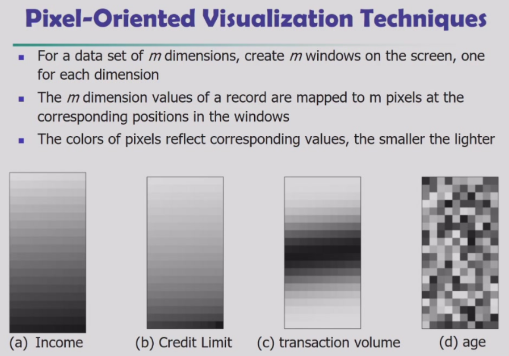
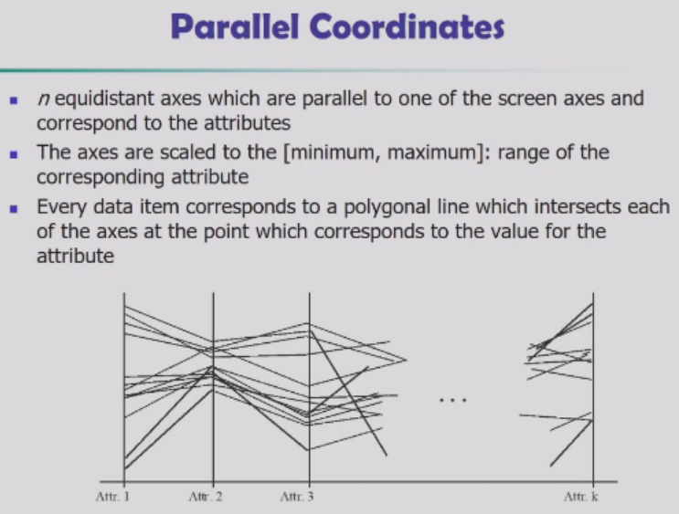

# 2. Data

[数据预分析 - Driven to discover (gitbook.io)](https://chmx0929.gitbook.io/machine-learning/shu-ju-wa-jue/shu-ju-wa-jue/shu-ju-ji-zhi-biao)

## Types & Attributes

### types of data sets

- record
  - relational records
  - documents data
  - matrix
  - transaction data
- ordered
  - media data
  - temporal data: time-series
  - sequential data: transaction data
  - genetic sequence data
- graph and network
  - www
  - social or information network
  - molecular
- spatial, image and multimedia
- important characteristic
  - dimensionality
  - sparsity: only presence counts
  - resolution: patterns depend on the scale
  - distribution: centrality & dispersion
- data object
  - a data object represents an entity
  - also called samples, examples, instances, objects, tuples
  - data object are described by **attributes**

### attribute types

- nominal
  - 名词
  - set of names of things
- binary
- ordinal
- numerical
  - quantity
  - interval
    - measured on a scale of **equal-sized units**
    - like temperature & calendar dates
    - **no true zero-point**
  - ratio
    - inherent **zero-point**
    - like length and counts
- discrete vs. continuous

## Basic Statistical Description

- mean
- median
- mode: most frequently occurred
- symmetric vs. skewed
  - symmetric: mean == median == mode
  - positive skewed: mean **better than** median **better than** mode
  - negative skewed: mean **worse than** median **worse than** mode
- dispersion
  - *quartiles*: Q~1~-25%
  - *inter-quartile range(IQR)*: Q~3~ - Q~1~ (中间50%)
  - *five number summary*: min, Q~1~, median, Q~3~, max
  - *boxplot*: a visualization method representing five number summary and outliers
  - *outlier*: usually, a value lower/higher than 1.5*IQR
- variance and standard deviation
- distribution
  - [central limit theorem](https://zhuanlan.zhihu.com/p/545895865)
  - [law of large numbers](https://zhuanlan.zhihu.com/p/259280292)
- displays
  - *boxplot*
  - *histogram*
    - often tells more than boxplot
  - *quantile plot*
    - x-axis indicating percentage $f$%, ranging from 0% to 100%
  - [*quantile-quantile(q-q) plot*](https://zhuanlan.zhihu.com/p/232271603)
  - *scatter plot*

## Data Visualization

- categorization
  - pixel-oriented
  - geometric projection
  - icon-based
  - hierarchical
  - visualizing complex data and relations

### pixel-oriented

- how to fill the pixel with different colors: to save space and show the connections among multiple dimensions, **space filling is often done in a circle segment**

### geometric projection

- visualization of **geometric transformations and projections of the data**
- methods
  - direct visualization
  - scatterplot and scatterplot matrices
  - landscapes
  - projection pursuit technique
  - prosection views 剖视图
  - hyperslice
  - parallel coordinates
- pixel-oriented methods provide little understanding of the data distribution in a multidimensional space however grometric projection techniques does

- scatterplot
  - good for low-dimensional data

- parallel coordinates
  - good for high-dimensional data

### Icon-based

- humans are more sensitive to icon/faces than to numbers
- [typical methods](https://www.slideshare.net/WafaQKhan/icon-based-visualization-techniques)
  - [Chernoff faces](https://cloud.tencent.com/developer/article/1131593)
  - Stick Figures

### hierarchical

- methods
  - worlds-within-worlds
  - tree-map
  - infocube

### complex data and relations

- non-numerical data
  - text: tag cloud
  - social network: graph & node

## Measuring Similarity & Dissimilarity

- similarity
  - higher when objects are more alike
  - often falls in [0, 1]
- dissimilarity
  - lower when objects are more alike
  - minimum dissimilarity is often 0
  - **upper limit varies**
  - dissimilarity matrix / distance matrix
    - a triangular matrix
    - single node
- proximity
  - refers to a similarity of dissimilarity

### proximity measuring

[数据挖掘：度量数据的相似性和相异性](https://zhuanlan.zhihu.com/p/347253198)

- for nominal 

  - method 1: simple matching, distance = mismatches / total
  - method 2: use a large number of binary attributes and make a mapping

- for binary

  - symmetric and asymmetric

  - > 当该属性的值只有0,1 两个值时,称为二元属性, 其实0值和1值有相同的重要性时称为**对称二元属性,**如性别中的男女, 当0和1有不一样的重要性时, 为**非对称二元属性,**如是否得癌症

- for numerical

  - Minkowski Distance
  - h=1: Manhattan distance (L~1~ norm)
  - h=2: Euclidean distance (L~2~ norm)
  - h=$\infin$: [Chebyshev distance](https://blog.csdn.net/qq_44163117/article/details/124342488) (L~max~ norm)

- for ordinal

  - can be treated like interval-scaled
    - replace $x_{if}$ by their rank
    - map the range of each variable onto [0, 1] by replacing $i$-th object in the $f$-th variable by $z_{if}=\frac{r_{if}-1}{M_f-1}$
    - compute the dissimilarity using methods for interval-scaled variables

- for mixed-type

  - use a weighted formula to combine their effects

- for documents

  - use cosine similarity

