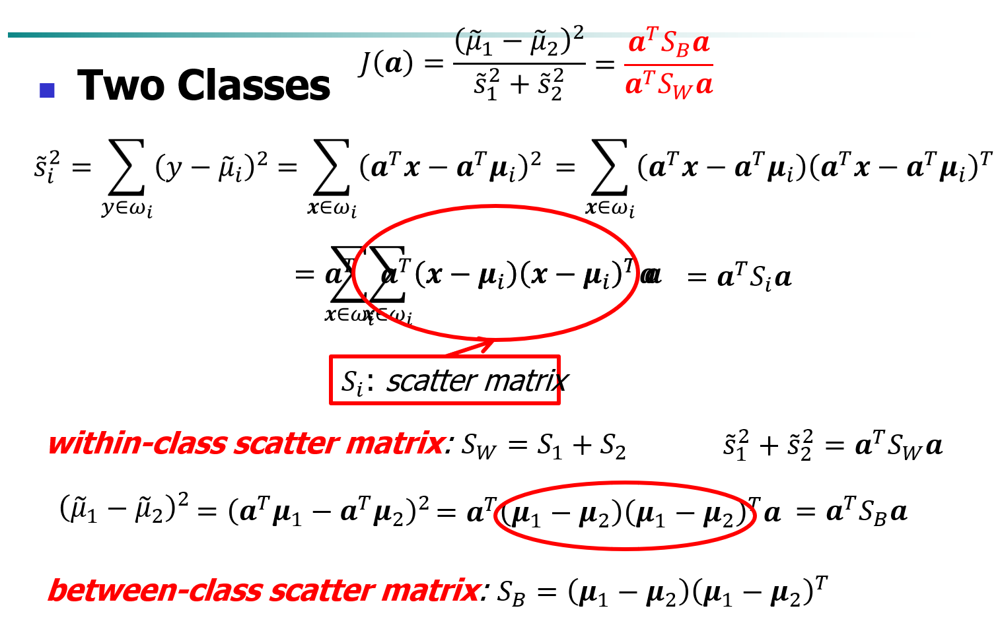
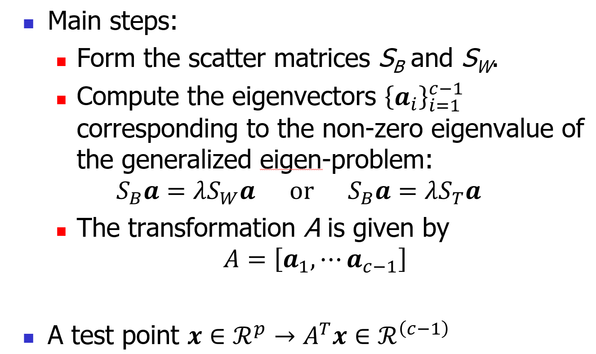
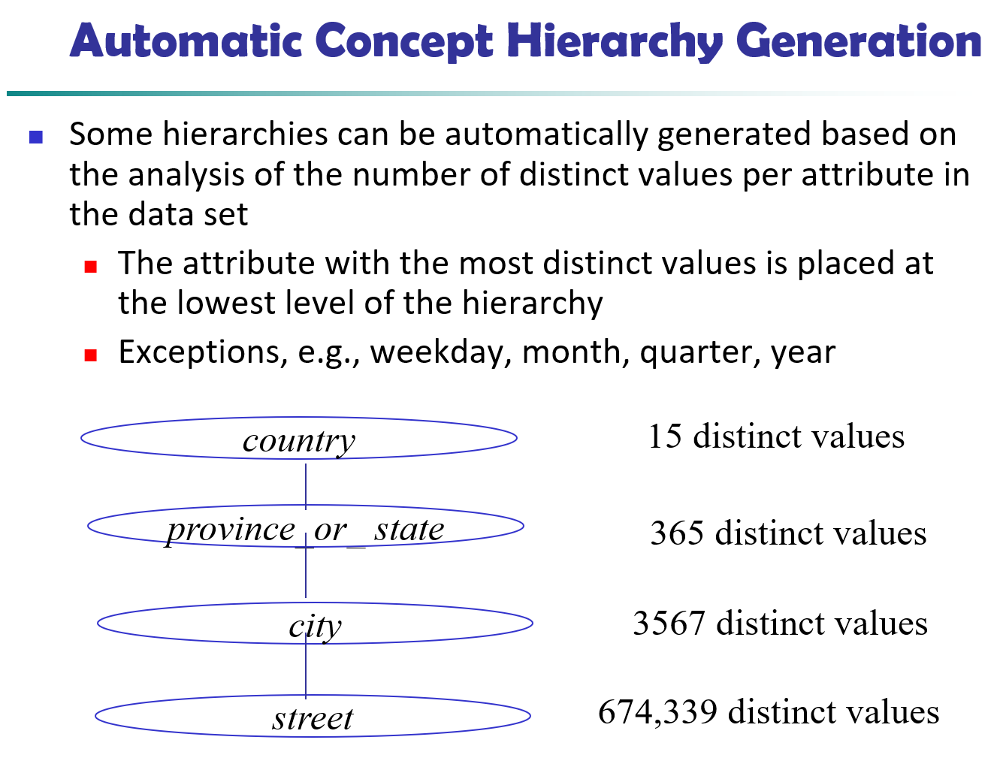

# 3. Data Preprocessing

[数据预处理 - Driven to discover (gitbook.io)](https://chmx0929.gitbook.io/machine-learning/shu-ju-wa-jue/shu-ju-wa-jue/shu-ju-yu-chu-li)

## Overview

- why? data quality
- main tasks
  - data cleaning
  - data integration
  - data reduction
  - data transformation

## Data Cleaning

- data can be dirty
  - incomplete
  - noisy
  - inconsistent
  - intentional
- handle incomplete
  - ignore the tuple
  - fill in manually
  - fill in automatically with
    - a global constant
    - the attribute mean
    - the attribute mean for all samples belonging to the same class
    - inference-based like Bayesian formula or decision tree
- handle noisy: mainly smoothing
  - binning
  - regression
  - clustering
  - combined computer and human inspection

## Data Integration

- combines data from multiple sources into a coherent store
- handle redundancy
  - object identification
  - derivable data
  - redundant attributes may be able to be detected by *correlation analysis* and *covariance analysis*
- correlation analysis
  - nominal data: [一文详解卡方检验](https://zhuanlan.zhihu.com/p/140043959)
  - numerical data: [Pearson correlation coefficient](https://blog.csdn.net/chao2016/article/details/80917579)
  - linear relationship: standardize and then dot product
    - $a'_k=(a_k-mean(A))/std(A)$
    - $b'_k=(b_k-mean(B))/std(B)$
    - $correlation(A,B)=A'\cdot B'$
- covariance analysis
  - numerical data: covariance

## Data Reduction

- Obtain a reduced representation of the data set that is much **smaller in volume** but yet produces the same (or almost the same) analytical results
- 2 dimensions
  - dimensionality reduction
  - numerosity reduction
  - data compression
- dimensionality reduction
  - why: **Curse of dimensionality**
    - When dimensionality increases, data becomes increasingly sparse / 稀疏
    - Density and distance between points, which is critical to clustering, outlier analysis, becomes less meaningful / 低维度方法无效了
    - The possible combinations of subspaces will grow exponentially
- Unsupervised methods
  - Latent Semantic Indexing (LSI): truncated SVD
  - **Principal Component Analysis (PCA)**
  - Independent Component Analysis (ICA)
  - Canonical Correlation Analysis (CCA)
- Supervised
  - **Linear Discriminant Analysis (LDA)**
- Semi-supervised
  - Semi-supervised Discriminant Analysis (SDA)
- Linear methods
  - Latent Semantic Indexing (LSI): truncated SVD
  - **Principal Component Analysis (PCA)**
  - **Linear Discriminant Analysis (LDA)**
  - Canonical Correlation Analysis (CCA)
- Nonlinear
  - Nonlinear feature reduction using kernels
  - Manifold learning

### dimensionality reduction 

- reduction: $A\in R^{p\times d}:\ \bold x\in R^p \to \bold z=A^T\bold x\in R^d$
  - Selection
    - choose a best subset of size *d* from the available *p* features
    - every column of $A$ is one-hot
  - Extraction
    - given *p* features (set $X$), extract *d* new features (set $Z$) by linear or non-linear combination of all the *p* features 
    - $\bold z=f(\bold x)$

#### PCA

- **unsupervised, traditional method (not AI), reduction**
- Reduce the dimensionality of a data set by finding a new set of variables, smaller than the original set of variables
- Retains most of the sample's information.
- Useful for the compression and classification of data. 
- By information we mean the variation present in the sample. 
- The new variables, called principal components (PCs), are **uncorrelated**, and are ordered by the fraction of the total information each retains.
- PCs (principal components) are a series of linear least squares fits to a line, each **orthogonal to all the previous**. 

Algorithm: 

- [CodingLabs - PCA的数学原理](http://blog.codinglabs.org/articles/pca-tutorial.html)
- In general: $var(z^{(k)}) = \bold a^T_kS\bold a_k=\lambda_k$
- The *k*^th^ largest eigenvalue of *S* is the variance of *k*^th^ PC.
- The *k*^th^ PC $z^{(k)}$ retains the *k*^th^ greatest fraction of the variation in the sample.
- Optimality: PCA projection minimizes the **reconstruction error** among all linear projections of size *d*

#### LDA

- **supervised learning, traditional method, discrimination**
  - 算类内和类间的时候需要知道每个数据是哪个类的

- Find a transformation $\bold a$, such that the $\bold a^TX_1$ and $\bold a^TX_2$  are maximally separated & each class is minimally dispersed (maximum separation)

- [机器学习-LDA(线性判别降维算法) - 知乎 (zhihu.com)](https://zhuanlan.zhihu.com/p/51769969)

- [线性判别分析LDA原理及推导过程（非常详细） - 知乎 (zhihu.com)](https://zhuanlan.zhihu.com/p/79696530)

- [机器学习（十七）——高斯判别分析模型（The Gaussian Discriminant Analysis model）-CSDN博客](https://blog.csdn.net/qq_31589695/article/details/80331593)

> 类间最开和类内最聚都一样重要

- 目标函数此时变成了$\max \frac{\bold a^TS_B\bold a}{\bold a^TS_W\bold a}$
  - B: between-class
  - W: within-class
- 不失一般性地，假设分母为1，那么优化目标变成了$\max \bold a^TS_B\bold a, s.t. \bold a^TS_W\bold a=1$
- 拉格朗日可以得$S_B\bold a = \lambda S_W\bold a$
- 又由于，我们只关心$\bold a$的方向而不关心大小，那么我们可以把标量项去掉，最后剩下$\bold a^*=S_W^{-1}(\mu_1-\mu_2)$

> 高斯分布的LDA和最大化类间方差、最小化类内方差的LDA实际上是同一个算法的不同表述。
>
> LDA是一种用于特征投影的监督学习算法，通常用于降维和模式识别。其目标是通过线性变换将数据投影到低维空间，同时最大化类间方差，最小化类内方差。这样做的目的是在降维的同时，使得不同类别之间的差异最大，同一类别内部的差异最小，从而更容易进行分类。
>
> 高斯分布的LDA是因为在LDA的推导中通常对数据的分布进行了假设，假设每个类别的数据都服从高斯分布。在LDA的假设下，每个数据的分布都具有相同的方差——池化方差。因此，你可以说高斯分布的LDA是LDA在特定分布假设下的一种形式。
>
> 简而言之，它们是同一个LDA，只是在描述时强调了不同的方面。

#### Others

- Attribute Subset Selection
  - Heuristic Search in Attribute Selection
- Attribute Creation (Feature Generation)
  - Create new attributes (features) that can capture the important information in a data set more effectively than the original ones

### numerousity reduction

- Reduce data volume by **choosing alternative, smaller forms** of data representation
  - Parametric methods (e.g., regression)
  - Non-parametric methods 
- Parametric Data Reduction
  - Linear regression $Y=wX+b$
  - Multiple regression $Y=b_0+b_1X_1+b_xX_2$
    - Allows a response variable *Y* to be modeled as a linear function of multidimensional feature vector
    - 线性组合
  - Log-linear model
- Non-parametric methods 
  - Histogram Analysis
  - Clustering
  - Sampling
    - Simple random sampling
    - Sampling without replacement
    - Sampling with replacement
    - Stratified sampling
  - [Data Cube Aggregation](https://blog.csdn.net/forlogen/article/details/88634117)

### data compression

- String compression
  - Typically lossless, but only limited manipulation is possible without expansion
- Audio/video compression
  - Typically lossy compression, with progressive refinement
  - Sometimes small fragments of signal can be reconstructed without reconstructing the whole
- Time sequence is not audio
  - Typically short and vary slowly with time

## Data Transformation and Data Discretization

- A function that maps the entire set of values of a given attribute to a new set of replacement values s.t. **each old value can be identified with one of the new values**

Transformation

- Smoothing: Remove noise from data
- Attribute/feature construction
- Aggregation
- normalization
  - min-max normalization: $v'=\frac{v-min}{max-min}(max_{new}-min_{new})+min_{new}$
  - Z-score normalization: $v'=\frac{v-\mu}{\sigma}$
  - normalization by decimal scaling: $v'=\frac{v}{10^j}$

Discretization

- Discretization: **Divide the range of a continuous attribute into intervals**
- Binning 
  - Top-down split, unsupervised
- Histogram analysis
  - Top-down split, unsupervised
- Clustering analysis 
  - unsupervised, top-down split or bottom-up merge
- Decision-tree analysis 
  - supervised, top-down split
- Correlation (e.g., c2) analysis 
  - unsupervised, bottom-up merge
- Concept Hierarchy Generation
  - 比如地址，从省份到街道

