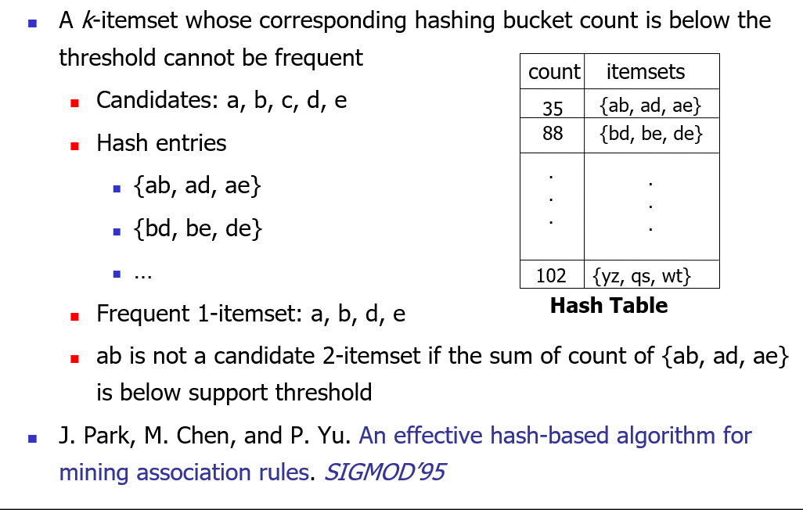

# 4. Frequent Patterns

- [Apriori算法详解 - 知乎 (zhihu.com)](https://zhuanlan.zhihu.com/p/341882260)

## Basic

- **Frequent pattern**: a pattern (a set of items, subsequences, substructures, etc.) that occurs frequently in a data set 
- **Motivation**: Finding inherent regularities in data
- frequent pattern
  - itemset: A set of one or more items
    - *k*-itemset $X = \{x_1, …, x_k\}$

  - *(absolute) support*, or, *support count* of $X$: Frequency or occurrence of an itemset $X$
  - *(relative)* *support*, *s*, is the fraction of transactions that contains $X$ (i.e., the probability that a transaction contains $X$)
  - An itemset $X$ is *frequent* if $X$’s support is no less than a *minsup* threshold

- association rule
  - for rules $X\to Y$
  - 支持度 *support*: probability contains $X\bigcup Y$, that is, $P(XY)$
  - 置信度*confidence*: probability contains $X$ and also contains $Y$, that is, $P(XY|X)$

- closed pattern & max pattern
  - A long pattern contains a combinatorial number of sub-patterns
  - An itemset $X$ is closed if $X$ is *frequent* and there exists *no super-pattern* $Y \supset X$, *with the same support* as X 同支持度下最长
  - An itemset $X$ is a max-pattern if $X$ is frequent and there exists no frequent super-pattern $Y \supset X$ 频繁条件下最长
  - Closed pattern is a lossless compression of freq. patterns

## Apriori: A Candidate Generation-and-Test Approach

- The **downward closure property** of frequent patterns

  - The downward closure property of frequent patterns

- Apriori

  - Apriori pruning principle: If there is any itemset which is infrequent, its superset should not be generated/tested! 

  > 逆反定理

  - Method: 
    - Initially, scan DB once to get frequent 1-itemset
    - **Generate** length $(k+1)$ candidate itemsets from length $k$ frequent itemsets
    - **Test** the candidates against DB
    - Terminate when no frequent or candidate set can be generated
  - algorithm
    - $L_k$: frequent $k$-itemset
    - $C_k$: frequent $k$-itemset candidate
    - The join step: use $l_1,l_2\in L_{k-1}$ to obtain $C_k$ 有且仅有两个元素（各一个）不一样
    - The prune step: $C_k$ is a superset of $L_k$. A database scan is needed to determine the $L_k$ in $C_k$. 查看所有的$(k-1)$-itemsets子集是否在$L_{k-1}$中
      - Subset testing: To reduce the size of $C_k$, the Apriori property can be used, i.e. any (*k-1*)-itemset that is not frequent cannot be a subset of a frequent *k*-itemset.

- Major computational challenges

  - Multiple scans of transaction database
  - Huge number of candidates
  - Tedious workload of support counting for candidates

- Improving Apriori: general ideas

  - Reduce passes of transaction database scans
  - Shrink number of candidates
  - Facilitate support counting of candidates

### Partition: Scan Database Only Twice

- Any itemset that is potentially frequent in DB must be frequent in at least one of the partitions of DB
  - Scan 1: partition database and find local frequent patterns
  - Scan 2: consolidate global frequent patterns

### DHP: Reduce the Number of Candidates

- 也就是说，几个加起来都没超过threshold，单个更加不可能超过

### DIC: Reduce Number of Scans

- [Dynamic Itemset Counting (uregina.ca)](https://www2.cs.uregina.ca/~dbd/cs831/notes/itemsets/DIC.html)
- Once both A and D are determined frequent, the counting of AD begins
- Once all length-2 subsets of BCD are determined frequent, the counting of BCD begins

## FPGrowth:  A Frequent Pattern-Growth Approach

[FP Growth Algorithm in Data Mining - Javatpoint](https://www.javatpoint.com/fp-growth-algorithm-in-data-mining)

[FP-growth算法理解和实现_fp growth-CSDN博客](https://blog.csdn.net/baixiangxue/article/details/80335469)

[FP-growth算法通俗讲解-CSDN博客](https://blog.csdn.net/u012494321/article/details/110310366)

[FP-growth算法发现频繁项集（二）——发现频繁项集 - 我是8位的 - 博客园 (cnblogs.com)](https://www.cnblogs.com/bigmonkey/p/7491405.html)

- **Without Candidate Generation**
- Bottlenecks of the Apriori approach
  - Breadth-first (i.e., level-wise) search
  - Candidate generation and test
- The FPGrowth Approach
  - Depth-first search
  - Avoid explicit candidate generation

- mining
  1. Start from each frequent length-1 pattern (as an initial suffix pattern), construct its *conditional pattern base* (the set of prefix paths + suffix pattern)
  2. Construct its conditional pattern base by following its chain of node-links
  3. Using the conditional pattern base as the transaction database, build its *conditional FT-tree*
  4. Pattern growth is achieved by concatenating the suffix pattern with the frequent pattern generated from a conditional FP-tree

构建FP树：

1. 算1-itemset的frequency，排除infrequent items，**第一次scan**
2. 排序
3. 建树，**第二次scan**

构建conditional pattern base：

1. 自底向上，选择某个item/node
2. 选定之后，向上回溯FP树，对路径上的item再次构建FP树
3. 筛选之后，与选定的item连接组合

## Mining Sequential patterns

- subsequence & super sequence
  - A sequence is an ordered list of events, denoted $< e_1\ e_2 … e_l >$
  - Given two sequences $α=< a_1\ a_2 … a_n >$ and $β=< b_1\ b_2 … b_m >$
  - $α$ is called a subsequence of $β$, denoted as $α\subseteq β$, if there exist integers $1≤ j_1 < j_2 <…< j_n ≤m$ such that $a_1 ⊆ b_{j1}, a2 ⊆ b_{j2},…, an ⊆ b_{jn}$
  - $β$ is a super sequence of $α$, E.g.α=< (ab), d> and β=< (abc), (de)> 
- Given a set of sequences and support threshold, find the complete set of *frequent* subsequences
- The Apriori Property of Sequential Patterns
  - If a sequence *S* is not frequent, then none of the super-sequences of *S* is frequent

### GSP—Generalized Sequential Pattern Mining

[GSP（Generalized Sequential Pattern Mining）算法_gsp算法例题-CSDN博客](https://blog.csdn.net/dpengwang/article/details/96437216)

- method
  - Initially, every item in DB is a candidate of length-1
  - for each level (i.e., sequences of length-k) do
    - scan database to collect support count for each candidate sequence
    - generate candidate length-(k+1) sequences from length-k frequent sequences using Apriori 
  - repeat until no frequent sequence or no candidate can be found

> 【注意：易错之处】
> 【注意一：】：k频繁序列：频繁序列中项目的个数为k;（是项目的个数，不是项目集）eg:<（面包，苹果）> 为2频繁序列 
>
> 【注意二：】：序列的长度：频繁序列中项目集的个数为k;（是项目的个数，不是项目集）eg:<（面包，苹果）> 长度为1 
>
> 【注意三：】：序列的大小：序列中物品的个数
>
> 【注意四：】：易错点：挖掘过程中的k-频繁集（Lk）或者候选k-集(Ck)指的都是【注意一和注意三】中的序列大小。
>
> 注意对长度大于1的情况分类，如长度为2的就包括\<AB\>和\<(AB)\>，ppt中的51中即是6\*6 + 6\*5/2

- algorithm
  - Take sequences in form of $<x>$ as length-1 candidates
  - Scan database once, find $F_1$, the set of length-1 sequential patterns
  - Let $k=1$; while $F_k$ is not empty do
    - Form $C_{k+1}$, the set of length-($k$+1) candidates from $F_k$;
    - If $C_{k+1}$ is not empty, scan database once, find $F_{k+1}$, the set of length-($k$+1) sequential patterns
    - Let $k=k+1$;
- Benefits from the Apriori pruning
  - Reduces search space
- Bottlenecks
  - Scans the database multiple times 
  - Generates a huge set of candidate sequences 

## Measurement

### Lift

[模型和策略效果衡量常用指标——LIFT提升度 - 简书 (jianshu.com)](https://www.jianshu.com/p/ff0eb70d31ec)
$$
lift=\frac{P(A\bigcup B)}{P(A)P(B)}
$$

> ppt解读，也就是说，看似打篮球的人往往吃麦片可信，但是其实绝大多数人都会吃麦片，支持度和置信度高可能是因为大多数人都吃麦片。
>
> 而打篮球的人往往不吃麦片，更加符合事实认知，但是支持度和置信度则较低。说明了用支持度和置信度来评价相关性是不合理的。

- Support and confidence are not good to indicate correlations
- Over 20 interestingness measures have been proposed, including *chi-square test* and *lift* 

> 选择使用支持度（support）而不是提升度（lift）作为算法运行时的衡量标准，通常是由关联规则挖掘的目标和算法的性质决定的。
>
> 1. **支持度（Support）：** 支持度是指包含某个项集的事务的比例。在关联规则挖掘中，支持度用于过滤掉那些在数据集中出现次数较少的项集，只保留频繁项集。算法的第一步通常是找到满足一定支持度阈值的频繁项集，以减小搜索空间。
> 2. **提升度（Lift）：** 提升度衡量的是规则的置信度相对于基线的提升程度。虽然提升度是一个很有用的度量，但它通常在挖掘阶段之后，用于筛选和解释挖掘得到的规则。提升度的计算涉及到置信度和支持度，而支持度可以在算法运行时用于快速过滤非频繁项集。
>
> 因此，支持度主要用于算法的初步筛选，以减少搜索空间，提高效率。在挖掘到频繁项集后，可以进一步使用提升度等指标来选择最有用的关联规则。